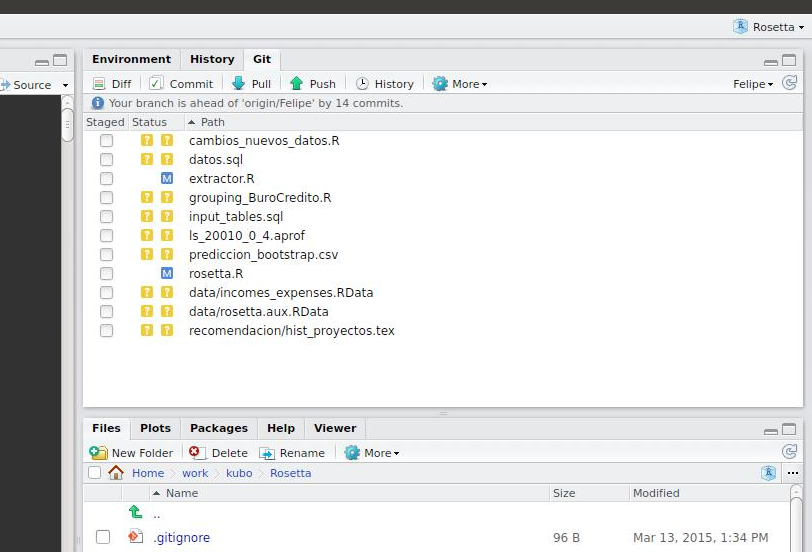

% Tecnologías Financieras
% Fernando Aguilar
% Junio 19, 2015

# Tecnologia financiera (Mucho antes)

# Tecnologia financiera (Antes)

# Tecnologia financiera (Hoy)

# Tecnologia Financiera (futuro)

 - Cloud
 - Reproducibilidad en varias plataformas
 - Self-service

# Git

- "Distributed Version Control System"
- ¿Por qué Git?
    * Box: NO hay cliente para Linux
    * Dropbox: Poco espacio y no hay tracing de cambios
    * SVN: Servidor central

# El origen de Git

 - Creado hace 10 años por Linus Torvalds (2005)
 - Herramienta para sustituir a SVN
 - Windows, Mac OS X, Linux 

# Git para todos

- Herramienta basada en comandos (consola)
- Frontends
    * Rstudio
    * eclipse
    * SAS

# ¿Cómo funciona git?

<iframe width="100%" height="80%" src="http://www.wei-wang.com/ExplainGitWithD3" frameborder="1" allowfullscreen></iframe>

<!-- Animacion -->
<!-- Alguien escribe en su computadora -->
<!-- Elige los archivos a guardar (stage) -->
<!-- Hace commit (commit) -->
<!-- Repite el proceso -->

<!-- Luego quiere compartir su trabajo -->
<!-- Tiene tres opciones: 1) on-premise, 2) github, 3) bitbucket -->
<!-- Hace push al "servidor remoto" -->
<!-- Mostrar aqui que no es centralizado -->

<!-- Luego alguien puede leer del "servidor remoto" -->
<!-- Hace pull del "servidor remoto" -->
<!-- Recibirá todos los archivos necesarios con TODOS los cambios -->
<!-- Hace comit y push y el "servidor remoto" guarda todos los cambios -->

<!-- 
En caso de que dos personas modifiquen los mismos archivos,
Git se encarga de combinar los cambios de ambas personas,
Si no lo logra, se pueden elegir manualmente 
-->

# Instala Git

[git-scm.org](http://git-scm.org/)

# `git config` 

Tenemos que configurar git antes de usarlo

~~~~~~~~~~~~~~~~~~~~~~~~~~~~~~~~~~~~~~~~~~ {.bash}
# Poner tu nombre:
git config --global user.name "Tu nombre"

# Poner tu correo:
git config --global user.email "Tu correo"

# Verificar el reslutado:
git config --global user.name 
git config --global user.email
~~~~~~~~~~~~~~~~~~~~~~~~~~~~~~~~~~~~~~~~~~

# `git init`

Sirve para crear repositorios (repo)

~~~~~~~~~~~~~~~~~~~~~~~~~~~~~~~~~~~~~~~~~~ {.bash}
# Crea y entra a un folder
mkdir mirepo; cd mirepo;

# Vemos que esto no sea un repo
git status

# Inicializa un repo
git init

# Verificamos que ya estamos en un repo
git status
~~~~~~~~~~~~~~~~~~~~~~~~~~~~~~~~~~~~~~~~~~

# `git add/rm`

Agrega o quita archivos del stage

~~~~~~~~~~~~~~~~~~~~~~~~~~~~~~~~~~~~~~~~~~ {.bash}
# Escribimos un archivo a-la-hacker-way
echo "hola $USER" > hola.txt

# Vemos que exista y lo mostramos en pantalla
ls -al hola.txt && cat hola.txt

# Agregamos al stage de git
git add hola.txt

# Verificamos el estado del repo
git status
~~~~~~~~~~~~~~~~~~~~~~~~~~~~~~~~~~~~~~~~~~

# `git commit`

Guarda los cambios en stage

~~~~~~~~~~~~~~~~~~~~~~~~~~~~~~~~~~~~~~~~~~ {.bash}
# Guardamos los cambios con un mensaje
git commit -m 'Archivo con mi nombre'

# No deberia haber archivos en stage
git status

# Vemos los cambios guardados
git log
~~~~~~~~~~~~~~~~~~~~~~~~~~~~~~~~~~~~~~~~~~

# `git push`

Guarda cambios en un "servidor remoto"

 1. Crea tu cuenta de GitHub [aqui](http://github.com/)
 2. Crea el repo `tutogit-fintech` en github
 3. Escribe en tu terminal:

~~~~~~~~~~~~~~~~~~~~~~~~~~~~~~~~~~~~~~~~~~ {.bash}
# Le decimos al repo donde esta el remoto
git remote add origin \
    https://github.org/<user>/tutogit-fintech

# Sincroniza con servidor remoto
git push -u origin master
~~~~~~~~~~~~~~~~~~~~~~~~~~~~~~~~~~~~~~~~~~

# `git clone`

Descarga un repo remoto

~~~~~~~~~~~~~~~~~~~~~~~~~~~~~~~~~~~~~~~~~~ {.bash}
# Descargamos un estudio 
# de imagenes de Instagram
git clone \
    https://github.org/dominofire/ejemplo.git

# Abrir el archivo .Rproj con Rstudio
~~~~~~~~~~~~~~~~~~~~~~~~~~~~~~~~~~~~~~~~~~

# Bonus: Rstudio

Rstudio tiene un panel integrado para trabajar con Git :D

# Bonus: github.io

Publica tus HTML's generados con Rmarkdown en linea.

1. Crea un repo en GitHub con el nombre  `<username>.github.io`
2. Crea un archivo `index.html` como entrada principal de tu sitio
3. Commit, push
4. `http://<username>.github.io`